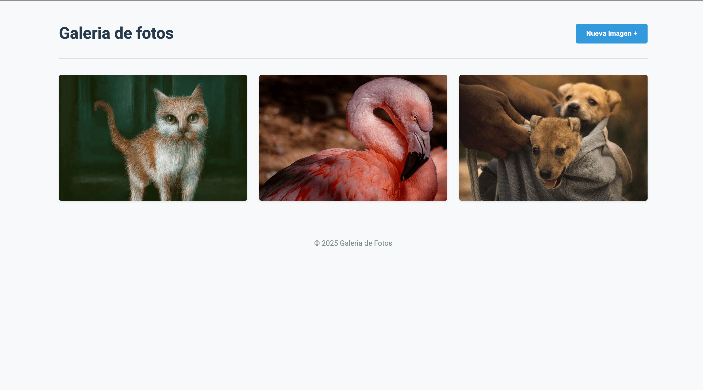

# Galería de Fotos Interactiva

Un proyecto web interactivo que permite a los usuarios visualizar una galería de imágenes y añadir nuevas imágenes a través de URLs.

## Tabla de contenidos

- [Resumen](#resumen)
  - [El reto](#el-reto)
  - [Capturas de pantalla](#capturas-de-pantalla)
  - [Enlaces](#enlaces)
- [Mi proceso](#mi-proceso)
  - [Construido con](#construido-con)
  - [Lo que aprendí](#lo-que-aprendí)
  - [Desarrollo continuo](#desarrollo-continuo)
  - [Recursos útiles](#recursos-útiles)
- [Autor](#autor)
- [Agradecimientos](#agradecimientos)

## Resumen

### El reto

Los usuarios deberían poder:

- Ver la galería de imágenes en un diseño responsivo y atractivo
- Hacer clic en "Nueva imagen +" para mostrar un formulario de entrada
- Añadir nuevas imágenes a la galería mediante URLs
- Ver las imágenes a tamaño completo al hacer clic en el enlace correspondiente
- Recibir feedback visual sobre acciones realizadas (éxito o error)
- Disfrutar de animaciones suaves durante las interacciones
- Navegar por la aplicación en dispositivos móviles y de escritorio

### Capturas de pantalla



### Enlaces

- URL del repositorio: [URL del repositorio](https://github.com/jorge-maikel-sierra/galeria-fotos)
- URL del sitio en vivo: [Añadir URL del sitio en vivo aquí](https://jorge-maikel-sierra.github.io/galeria-fotos)

## Mi proceso

### Construido con

- HTML5 semántico
- Variables CSS personalizadas
- Flexbox y CSS Grid
- Diseño responsive
- jQuery para manipulación del DOM y eventos
- Enfoque mobile-first
- Buenas prácticas de accesibilidad
- Optimización de rendimiento

### Lo que aprendí

Durante el desarrollo de este proyecto, aprendí:

1. **Implementación de formularios interactivos**: Cómo crear formularios que aparecen y desaparecen con animaciones suaves.

```js
function toggleFormulario() {
  DOM.formAdicionar.toggleClass('hidden');
  
  if (!DOM.formAdicionar.hasClass('hidden')) {
    DOM.inputUrl.focus();
  }
}
```

2. **Validación de entradas del usuario**: Cómo verificar que las URLs proporcionadas son válidas antes de procesarlas.

```js
function isValidUrl(url) {
  try {
    new URL(url);
    return true;
  } catch (e) {
    return false;
  }
}
```

3. **Uso de CSS Grid para diseños responsivos**: Cómo crear una galería que se adapta a diferentes tamaños de pantalla.

```css
.lista-imagens {
  display: grid;
  grid-template-columns: repeat(auto-fill, minmax(300px, 1fr));
  gap: 1.5rem;
  list-style: none;
}
```

4. **Mejora de la accesibilidad**: Implementación de etiquetas semánticas y atributos ARIA para mejorar la experiencia de los usuarios con lectores de pantalla.

```html
<h2 class="sr-only">Imagens da galeria</h2>
<button type="button" id="btn-nova-imagem" aria-label="Adicionar nova imagem">Nova imagem +</button>
```

### Desarrollo continuo

En futuras iteraciones del proyecto, me gustaría enfocarme en:

- Implementar almacenamiento local para guardar las imágenes añadidas
- Añadir funcionalidad de arrastrar y soltar para subir imágenes
- Implementar un sistema de etiquetas para organizar las imágenes
- Crear una vista de presentación de diapositivas para las imágenes
- Añadir la posibilidad de eliminar imágenes existentes
- Implementar mejoras de rendimiento como la carga diferida avanzada

### Recursos útiles

- [MDN Web Docs](https://developer.mozilla.org) - Una excelente fuente de información sobre HTML, CSS y JavaScript.
- [CSS-Tricks](https://css-tricks.com/snippets/css/complete-guide-grid/) - Su guía sobre CSS Grid fue invaluable para diseñar la galería.
- [jQuery API Documentation](https://api.jquery.com) - Referencia completa para jQuery que me ayudó a manejar eventos y manipulación del DOM.

## Autor

- GitHub - [@jorge-maikel-sierra](https://github.com/jorge-maikel-sierra)
- Frontend Mentor - [@jorge-maikel-sierra](https://www.frontendmentor.io/profile/jorge-maikel-sierra)
- Twitter - [@Jorge_Sierra_1](https://x.com/Jorge_Sierra_1)


## Agradecimientos

Quisiera agradecer a:

- Mi mentor, quien me proporcionó comentarios constructivos durante el desarrollo del proyecto
- La comunidad de desarrolladores web, cuyos tutoriales y artículos me ayudaron a resolver problemas
- Los compañeros de trabajo que probaron la aplicación y proporcionaron valiosos comentarios
- Todos los que inspiraron el diseño y la funcionalidad de esta galería de fotos